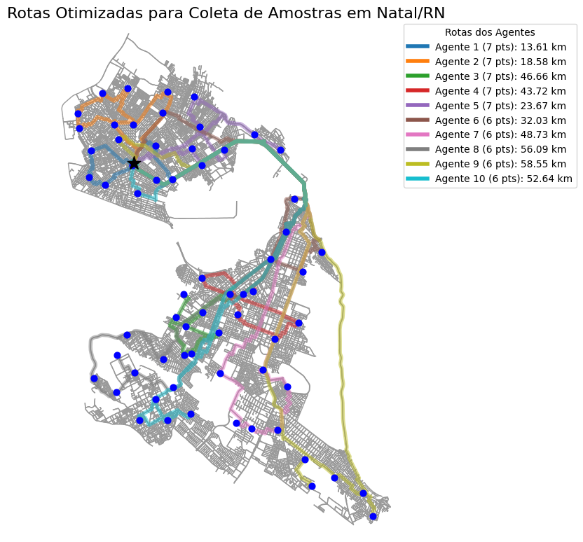
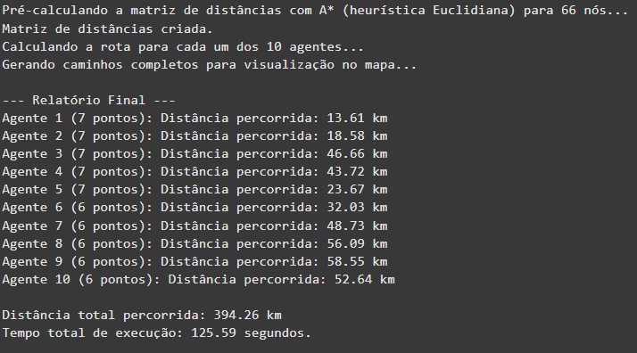
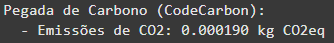
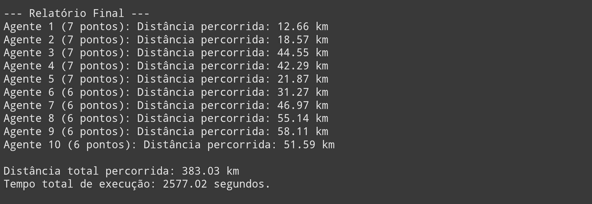
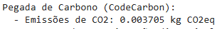
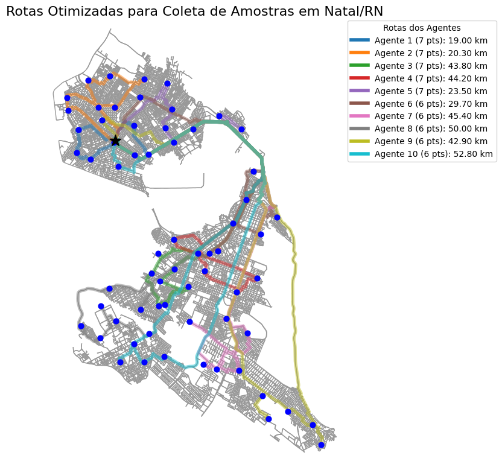
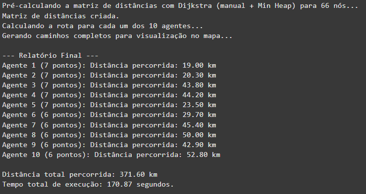
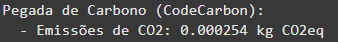

# 🧭 Trabalho U2T2 - Mapeamento de Rotas para Coleta Domiciliar

O Centro de Controle de Zoonoses de Natal é responsável por ações de vigilância e controle de doenças transmitidas por animais. Uma das atividades realizadas pelo órgão envolve a vigilância e o controle do mosquito Aedes aegypti através de uma estratégia que usa os ovitrampas (recipientes atrativos para as fêmeas do mosquito depositarem os seus ovos). Então, os agentes do CCZ selecionam pontos estratégicos para a instalação das ovitrampas e periodicamente visitam esses locais para coletar as palhetas com ovos, substituindo-as por novas.

O objetivo desse trabalho é desenvolver uma estratégia de mapeamento de rotas que otimize a distância total percorrida por cada colaborador e distribua os pontos equitativamente entre os 10 colaboradores, considerando que cada agente parte da estação central, visita X casas e retorna para a estação.

### Grupo responsável
- Celine Helena Abrantes de Andrade.  Matrícula: 20200078207.
- Gustavo Pereira de Carvalho. Matrícula: 20210039543.
- Matheus Bezerra Dantas Saraiva. Matrícula: 20230093901

---

## Vídeo explicativo
🎥 [Link para o vídeo](https://youtu.be/wmg7X3EI-k0)

---

## 📁Estrutura do Repositório

No total, foram utilizadas três versões diferentes de um programa em Python para calcular as melhores rotas para o percurso de coleta das amostras pelos 10 agentes. Os códigos utilizados estão disponíveis na pasta `src` e implementam abordagens diferentes para calcular o caminho mais curto. A primeira versão utiliza o algoritmo A*, a segunda utiliza o algoritmo de Dijkstra e, finalmente, a terceira utiliza uma versão otimizada do Dijkstra com *min heap*.

Os mapas gerados pelos programas estão salvos na pasta `img`, na forma de imagens, além de serem apresentados junto dos resultados. Além disso, os prompts utilizados para gerar os códigos iniciais com a ajuda de ferramentas de LLM estão disponíveis no arquivo `LLM.md`.

---
## 🛠️ Desenvolvimento 

Os códigos iniciais foram gerados utilizando as ferramentas de LLM ChatGPT e Gemini 2.5 Pro. A partir desses códigos, foram feitas pequenas correções para que os programas funcionassem da forma desejada e, a partir daí, foram realizados testes, executando os programas no ambiente do Google Colab.

Como o trabalho foi desenvolvido voltado para a cidade de Natal-RN, foi necessário importar o mapa viário da cidade através da biblioteca OSMnx. Esse mapa, organizado na forma de grafo, pode ser manipulado através de funções disponíveis na biblioteca NetworkX.

A implementação do algoritmo A* utilizada foi a opção disponibilizada pela própria biblioteca NetworkX, junto de uma heurística Euclidiana. As versões com Dijkstra e *min heap* utilizam implementações próprias.

Ao fim da execução, os programas exibem métricas de desempenho, como tempo de execução e pegada de carbono — esta última calculada através da biblioteca CodeCarbon. Também são exibidas as distâncias percorridas por cada agente nas rotas calculadas e um mapa que mostra todas as rotas encontradas, a distância de cada uma e o trajeto total.

---
## 📊 Resultados

Após a execução dos algoritmos de menor caminho (A*, Dijkstra Tradicional e Dijkstra com Min-Heap) sobre as rotas planejadas, foram obtidos os resultados que estao na tabela comparativa. 

A partir dela percebe-se que  o algoritmo de A* foi ligeiramente mais rápido que o Dijkstra Min-Heap, mas apresentou uma distância total um pouco maior. E o Dijkstra Tradicional, mesmo fornecendo uma rota competitiva em distância, foi consideravelmente mais lento, o que evidencia sua baixa eficiência computacional para grafos grandes.

Com respeito das emissões de carbono revelam que o menor caminho nem sempre é o mais rápido.

Com base nos mapas:

- Todos os algoritmos distribuíram os pontos de forma relativamente balanceada entre os 10 agentes.

- O A* parece privilegiar caminhos mais diretos em vias principais, possivelmente por conta da heurística baseada em distância euclidiana.

- O Dijkstra Tradicional pode gerar resultados mais “exatos” em termos de distância, mas o custo computacional é alto.

As saídas de cada programa foram organizadas abaixo:

<h2>Versão 1: Algoritmo A* com Heurística Euclidiana</h2>

<strong>Figura 1</strong>: Mapa de rotas A*

<strong>Figura 2</strong>: Saída do programa A*

<strong>Figura 3</strong>: Emissão de carbono A*

<h2>Versão 2: Algoritmo de Dijkstra</h2>

<strong>Figura 1</strong>: Mapa de rotas Dijkstra

<strong>Figura 2</strong>: Saída do programa Dijkstra

<strong>Figura 3</strong>: Emissão de carbono Dijkstra

<h2>Versão 3: Dijkstra com Min-Heap</h2>

<strong>Figura 1</strong>: Mapa de rotas Min-Heap

<strong>Figura 2</strong>: Saída do programa Min-Heap

<strong>Figura 3</strong>: Emissão de carbono Min-Heap

---

## Análise de Eficiência

A comparação entre os três algoritmos evidencia diferenças significativas em termos de **tempo de execução** e **eficiência computacional**:

### 🟡 Dijkstra (versão pura)
O algoritmo de Dijkstra clássico é conhecido por sua **precisão**, mas também pelo **alto custo computacional**, especialmente em grafos grandes e densos, como mapas urbanos. Neste projeto, essa versão levou aproximadamente **40 minutos** para completar a tarefa, o que a torna **pouco prática para aplicações em tempo real**. Isso ocorre porque a busca percorre todos os nós acessíveis sem priorização, o que gera muitas operações desnecessárias.

### 🟢 Dijkstra com Min-Heap
A introdução de uma estrutura de dados mais eficiente — a **Min-Heap** — para armazenar os nós a serem explorados, reduz drasticamente o tempo de execução para cerca de **3 minutos**. Essa melhoria ocorre porque a **Min-Heap permite acesso mais rápido ao próximo nó com menor custo**, reduzindo a complexidade da operação de extração do menor valor de `O(n)` para `O(log n)`. Com isso, o algoritmo mantém a precisão do Dijkstra original, mas com um ganho expressivo em desempenho.

### 🔵 A* com heurística Euclidiana
O algoritmo A* superou os demais em **velocidade e eficiência geral**. Ele é baseado no Dijkstra, mas com a vantagem de incorporar uma **heurística (neste caso, a distância Euclidiana até o destino)** para guiar a busca de forma mais inteligente. Isso significa que o A* evita expandir caminhos pouco promissores, reduzindo drasticamente o número de nós visitados. Na prática, isso resultou em **tempos de execução ainda menores que o Dijkstra com Min-Heap**, além de menor emissão de carbono computacional.

---

## Conclusão

- O **Dijkstra puro** é funcional, porém **ineficiente para problemas de grande escala**.
- O **Dijkstra com Min-Heap** representa uma **evolução importante**, com grande ganho de tempo sem perda de exatidão.
- O **A\*** se mostra o **mais eficiente**, especialmente em cenários com ponto de destino conhecido, pois a heurística ajuda a focar a busca e reduzir o esforço computacional.

Essa análise destaca a importância de escolher o algoritmo mais adequado com base no **tamanho do problema**, **requisitos de tempo** e **capacidade computacional disponível**. A versão com Min-Heap do Dijkstra foi a mais equilibrada entre eficiência, economia de distância e sustentabilidade ambiental. O uso do A* também se mostrou eficiente em tempo, embora com rota um pouco mais longa.

